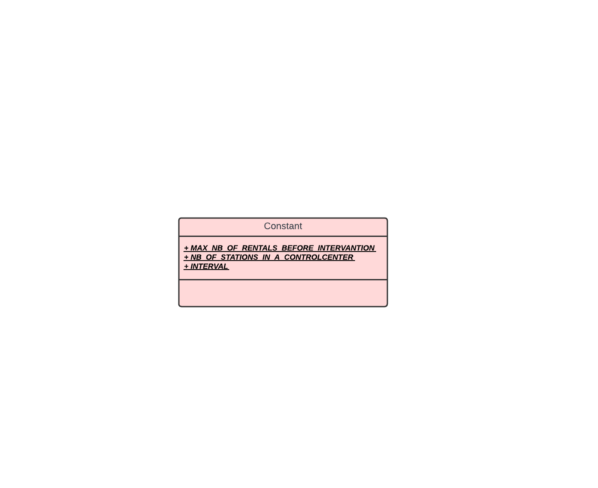
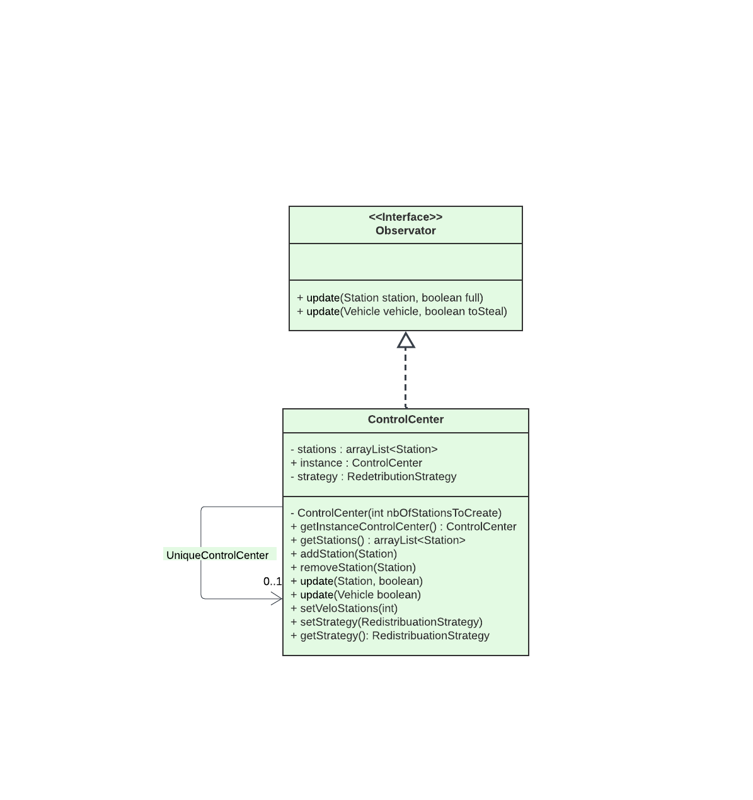
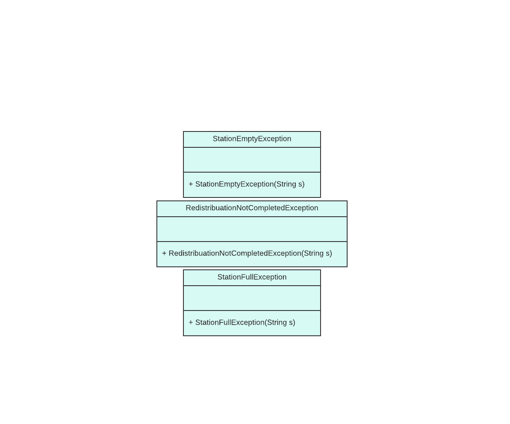
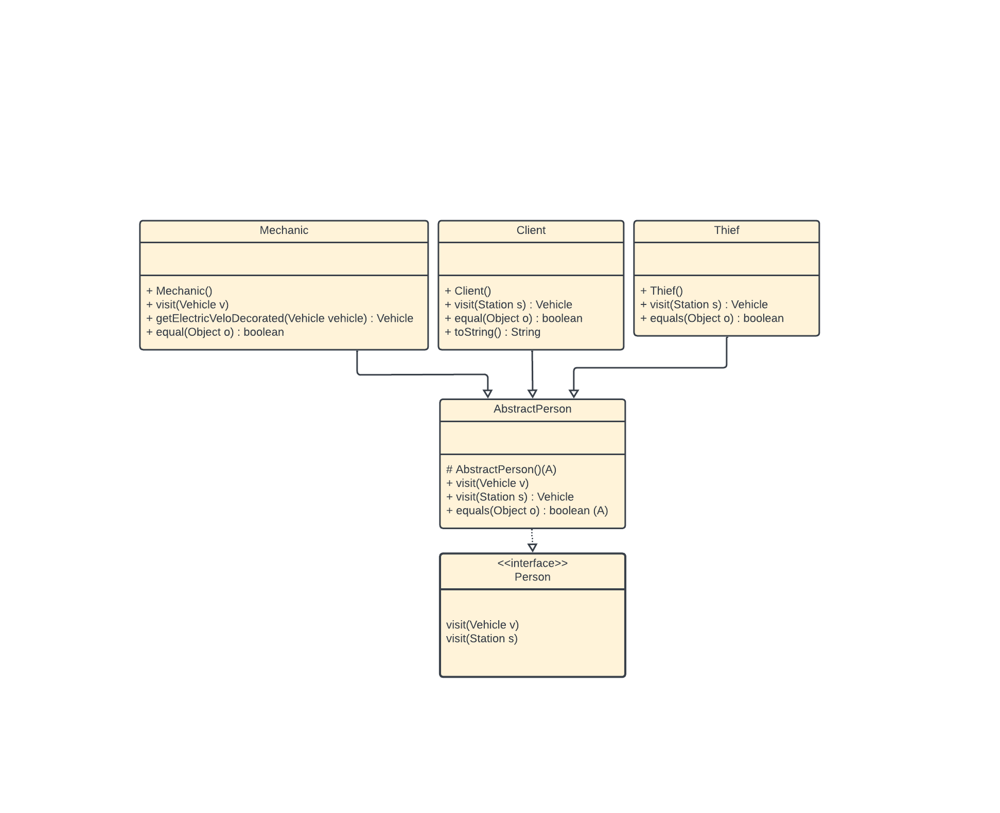
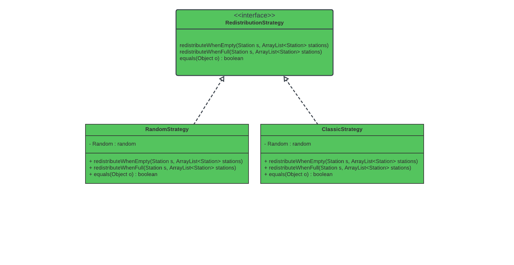
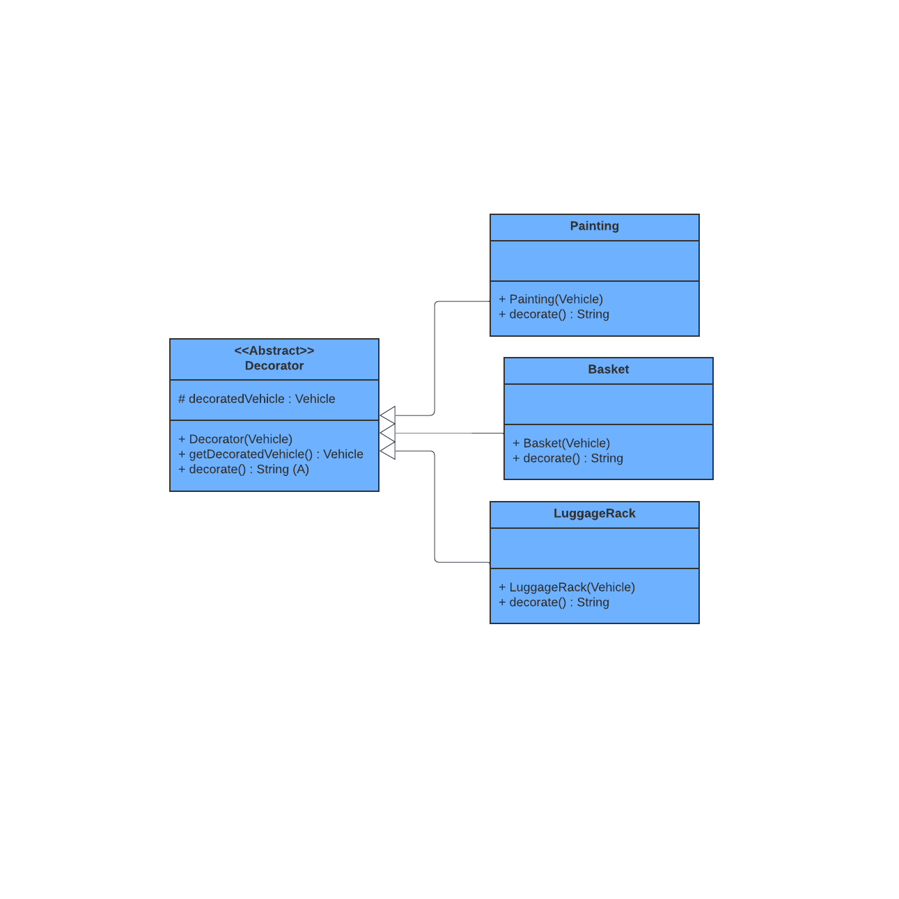
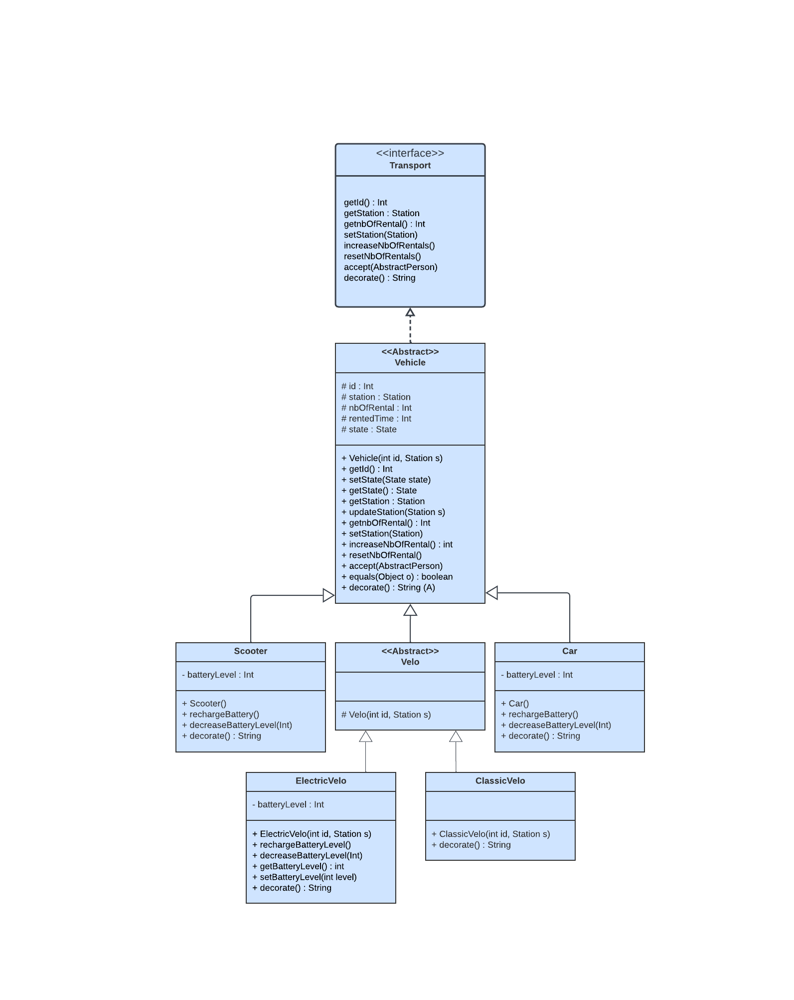
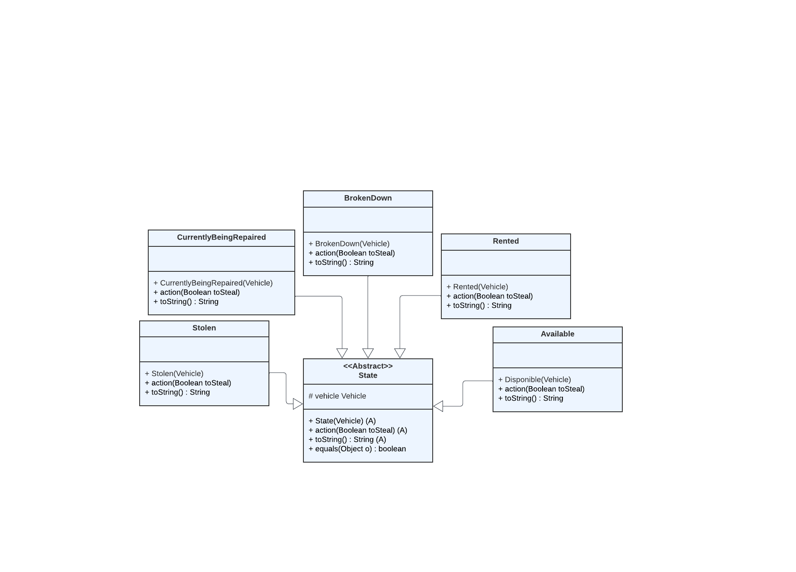

# Projet Vélos Libre Service Vlille 
## Binôme

    Madjid DERMEL
    Manil DIAF

## Introduction

- Ce projet vise à développer une simulation d'un système de location de vélos en libre-service, similaire aux services Vélib' ou V'Lille. Nous allons concevoir et implémenter un système comprenant des stations de location, des vélos de différents types, un centre de contrôle pour la supervision, et d'autres fonctionnalités telles que la redistribution des vélos, la réparation des vélos, et même la possibilité de vol.

## HowTo : 

### Récupérer les sources du projet

- Pour récupérer les sources du projet, vous pouvez cloner le dépôt depuis GitLab en utilisant la commande suivante :

```bash
git clone https://gitlab-etu.fil.univ-lille.fr/manil.diaf.etu/vlille_diaf_dermel.git
```

### Générer la documentation

- La documentation du projet est générée à l'aide de Javadoc. Vous pouvez générer la documentation en utilisant la commande suivante :

```bash
make doc
```

- La documentation sera générée dans le dossier docs.

### Compiler et exécuter les sources

- Pour compiler les sources, utilisez la commande suivante :

```bash
make classes
```

### Compiler et exécuter les tests

- Pour compiler les tests, utilisez la commande suivante :

```bash
make compileTests
```

- Pour exécuter les tests, utilisez la commande :

```bash
make runTests
```

- Pour exécuter le programme, utilisez la commande :

```bash
make start
```

### Générer et exécuter l'archive (.jar) du projet

- Pour générer l'archive du projet, utilisez la commande :

```bash
make jar
```

- Pour exécuter l'archive, utilisez la commande :

```bash
make runJar
```

## Éléments de code saillants

### Conception

-  Notre conception est basée sur les principes de la conception orientée objet pour modéliser les stations, les vélos, le centre de contrôle, les corps de métier, etc.
- Nous avons mis en œuvre des design patterns pour améliorer la modularité de notre système :
    - Observer a été utilisé pour le centre de contrôle, permettant ainsi au centre de contrôle de surveiller et de réagir aux changements dans le système de location.
    - Visitor a été appliqué pour le module "Persons", ce qui facilite l'ajout de nouvelles fonctionnalités ou de nouveaux comportements aux personnes interagissant avec les vélos.
    - Decorator a été utilisé pour les vélos avec des accessoires tels que le panier ou le porte-bagages, permettant de les ajouter dynamiquement aux vélos existants.
    - State a été adopté pour représenter l'état des vélos (loué, en panne, volé, disponible, en réparation), ce qui permet une gestion plus efficace de leur comportement.
    - Singleton a été utilisé pour le contrôle du centre, garantissant ainsi qu'une seule instance du centre de contrôle existe dans le système.
    - Strategy a été mis en œuvre pour gérer les différentes stratégies de redistribution des vélos, permettant d'ajouter de nouvelles stratégies sans modifier le code existant.

## Tests

- Nous avons élaboré une suite de tests approfondis visant à garantir la qualité, la fiabilité et la robustesse de notre code. 
- Pour assurer une vérification systématique de toutes les parties du projet, nous avons utilisé JUnit 5 comme framework de test. 
- De plus, dans certaines situations où il était difficile de tester directement certaines fonctionnalités, nous avons recouru à l'utilisation de mocks pour simuler des comportements spécifiques et ainsi renforcer la couverture de nos tests. 
- Cette approche globale garantit que notre système est bien testé sous diverses conditions et qu'il répond aux exigences de qualité attendues.

## Fonctionnement global

- Notre projet simule efficacement un système de location de vélos en libre-service, y compris des fonctionnalités avancées telles que la redistribution des vélos, la réparation des vélos, et la gestion des vélos volés.
La conception modulaire et extensible permet d'ajouter facilement de nouveaux modes de transport urbain et de nouvelles fonctionnalités pour répondre aux besoins futurs.

## Points Forts

### Adaptabilité et Extensibilité

- Notre système est conçu pour s'adapter et évoluer facilement, grâce à l'utilisation judicieuse de design patterns et d'une architecture modulaire. Cette adaptabilité permet d'intégrer de nouvelles technologies ou fonctionnalités sans perturber l'infrastructure existante.

### Fiabilité et Robustesse

- Grâce à des tests approfondis et à une conception réfléchie, notre système promet une expérience utilisateur fiable et sécurisée. La robustesse du code garantit que le système peut gérer efficacement les défis opérationnels et les scénarios imprévus.

## Diagrammes UML de chaque package

#### constants :



#### contorlCenters :



#### exceptions :



#### persons :



#### redistributionStrategy :



#### vehiclesDecorator :



#### vehicles :



#### vehiclesState :


